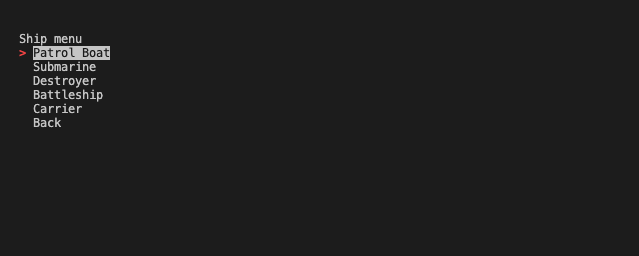

# Battleships
[Battleships](https://pp3-battleships.onrender.com/) is a python terminal application that allows the user play the classic battleship game with advanced ai algorithm.

Users can start game with random placement of ships, or manually place the ship to the users defined positions on the board.

---

### How to use    

1. Open this [link](https://pp3-battleships.onrender.com/) or copy it from here: `https://pp3-battleships.onrender.com/`, paste it into your browser's address bar, and press enter.
2. When the page is loaded, click the "RUN PROGRAM" button.
3. Navigate through the menu options using the arrow keys on your keyboard, press enter to choose an option.
4. Start game with random ship placement or manually place ships.
5. Then, you will take turns to find and hit enemy ships.
6. Enemy will make move after your turn
6. Game ends when either the computer or player fleet have been sunk.

---

### User stories

- As a first-time visitor, I want to be able to understand the main purpose of the application.
- As a first-time visitor, I want to be able to see the instructions on how to use the application.
- As a first-time visitor, I want to be able to see the different types of patterns that can be generated.
- As a first-time visitor, I want to be able to see the different algorithms that can be used to find the shortest path between the start and end points.
- As a user, I want to be able to see how the algorithms work with different patterns and different start and end nodes placement on the grid.
- As a user, I want to be able to change the pattern type, start and end nodes placement, and algorithm without restarting the application.

---

### Features
- ##### Main menu.
The user can see the main menu with options to start the application or exit.

- ##### Start menu.
When start is selected the user will be displayed a message stating 'Starting Battleship Game...' with two new options random placement or manual placement

- ##### Random Placement.
The game will start with random placement for both computer and player ships

- ##### Manual Placement.
New menu option for all ships to be placed on board, user to select each ship and manual place in desired location

- ##### Ship Placement.
When user select a ship from the options the board will be displayed and user can move ship on board

- ##### Confirm Placement and start game menu.
Once user has placed all ships on the board they will be provided with a new menu to start game or reset all ships

- ##### Exit.
The last option in the main menu is the "Exit". Here, the user can exit the application and see the game closing message.

 

---

### Flowchart

---

### Technologies used

###### Languages

- [Python](https://www.python.org/): The main language used to develop the application.
- [JavaScript](https://www.javascript.com/): The language used by the Code Institute to run the mock terminal in the browser.
- [HTML](https://www.w3schools.com/html/): The language used by the Code Institute to create the layout needed to run the mock terminal in the browser.

###### Frameworks, libraries, and packages
- [random](https://docs.python.org/3/library/random.html): used to generate random numbers.
- [numpy](https://docs.scipy.org/doc/numpy/reference/): used to generate a 2d array used to represent the grid.
- [time](https://docs.python.org/3/library/time.html): sleep function from the time library was used to make every step of the grid update visible to the user.
- [blessed](https://pypi.org/project/blessed/): used to manipulate the terminal output.
- [simple-term-menu](https://pypi.org/project/simple-term-menu/): used to create the terminal menu for the application.

###### Other tools
- [Git](https://git-scm.com/): used to manage the application source code.
- [GitHub](https://github.com/): used to host the application source code.
- [Visual Studio Code](https://code.visualstudio.com/): used to edit the application source code.
- [Chrome](https://www.google.com/chrome/): used to run the application in the browser.
- [Draw.io](https://www.draw.io/): used to create the flowchart.

---

### Bugs and issues

- ##### Solved bugs
- Fix AI move for ship placement parallel next to edge or parallel adjacent to board edge by checking for unused successful hits in opposite direction
- Fix ship rotation method to have a starting node pivot point as first node in list
- Fix computer move as inverted col, row tuple
- Fix random displacement for row and col by inverting ship size tuple.
- Fix node location method to return correct sequence of col then row
- Fix node display to show 'X' when used and occupied node

- ##### Unsolved bugs
- No unsolved bugs

---

### Testing

The application was tested manually during the whole development process. Visual Studio Code terminal was used to run the application locally, and the mock terminal provided by the Code Institute was used to run the application in the browser.

###### Validator results

---

### Deployment

The application was deployed to [Render](https://www.render.com/) and can be accessed from the following link: [Battleships](https://pp3-battleships.onrender.com/)

#### Heroku deployment

**The steps to deploy the application to Heroku are:**

1. Create a Heroku account if you don't have one.

2. In the dashboard, go to the "Apps" tab.

3. Click on the "New" button and choose "Create a new app".

4. Enter a name for the app.

5. Choose a region.

6. Click on the "Create" button.

7. Open the app you created and go to the "Settings" tab.

8. At the "Config Vars" section, click on the "Add" button and enter the following:

    - key: `PORT`
    - value: `8000`

9. At the "Buildpacks" section, click on the "Add" button and choose:

    - Python
    - Node.js
    The order of the buildpacks is important.

10. After that, click on the "Deploy" tab.

11. At the "Deployment method" section, choose GitHub and connect your GitHub account.

12. Then, you need to choose the repository you want to deploy.

13. Go down to the "Manual deploy" section, choose the branch you want to deploy, and click on the "Deploy branch" button.

14. The application will be deployed to Heroku. You can access it by clicking on the "View" button.

**The steps to run the application locally on your machine are:**

1. The application requires you to have Python 3 installed on your machine.

    - If you are using Windows, you can download Python 3 from [Python website](https://www.python.org/downloads/windows/).

    - If you are using Linux, the Python 3 installation is probably already included in your distribution, but if not, you can install it by running the following command in your terminal:

        + For Ubuntu or other Debian based distributions: `sudo apt-get install python3`
        + For Fedora or other Red Hat based distributions: `sudo yum install python3`
        + For Arch Linux based distributions: `sudo pacman -S python3`
        + Other installation instructions can be found [here](https://www.python.org/downloads/).

    - If you are using macOS, you can download Python 3 from [Python website](https://www.python.org/downloads/macosx/).

2. Now, you need to download the application source code from GitHub.

    + Go to the GitHub repository, click on the "Download ZIP" button, and extract the zip file's contents to the folder where you want to place the application.

    + Or use the following command to download the application source code:
        + `git clone https://github.com/Hussain-Naik/PP3-Battleships.git`

3. Now, you need to install the dependencies.

    + Navigate to the folder where you placed the application source code and run the following command:
        + `pip3 install -r requirements.txt`

4. Now, you can run the application on your machine by running the following command:
    + `python3 run.py`
    
#### Render deployment

1. Create a new Render account if you don't already have one here [Render](https://render.com/).

2. Create a new application on the following page here [New Render App](https://dashboard.render.com/), choose **Webserver**:

3. Select the GitHub option and connect the application to the repository you created.

4. Search for the repository you created and click "Connect."

5. Create name for the application

6. Select the region where you want to deploy the application.

7. Select branch to deploy.

8. Select environment.

9. Render build command: `pip install --upgrade pip && pip3 install -r requirements.txt && npm install`

10. Render start command: `node index.js`

11. Select Free plan.

12. Click on "Advanced" settings.

13. Add the following environment variables:

    - Key: PORT Value: 8000
    - Key: PYTHON_VERSION Value: 3.10.7

14. Click "Create Web Service."

15. Wait for the completion of the deployment.

---

### Credits

- [Aleksei Konovalov](https://github.com/lexach91) great guidance and mentor throughout project, as the battleship concept revolved round a node elements to make the board and ship fragments. 
